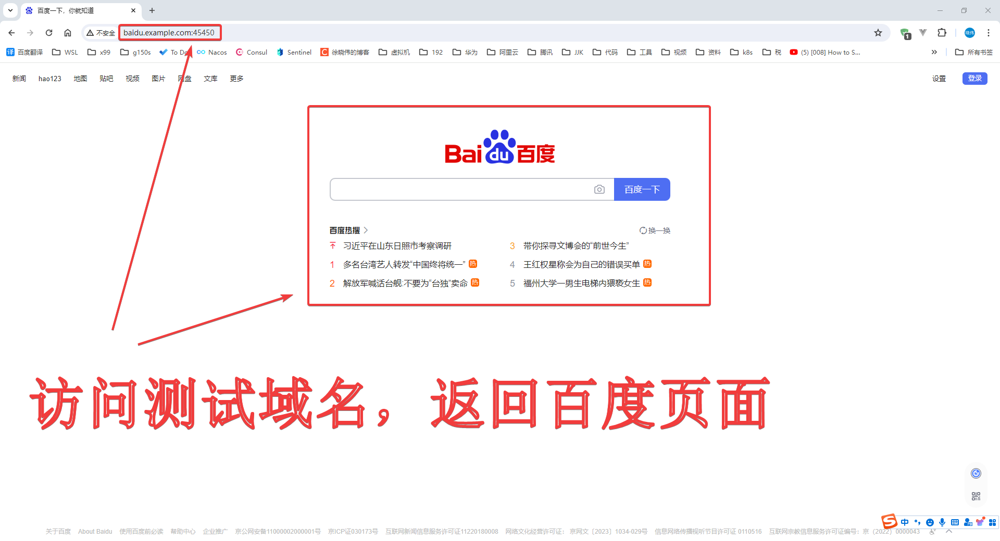

    <h1>gateway-shield</h1>
    <h3>网盾</h3>
    
    
    
    
    

    

## 文档

|                | 链接                                                       | 说明    |
|----------------|----------------------------------------------------------|-------|
| 文档             | [链接](https://gateway-shield.xuxiaowei.com.cn)            | 自动化部署 |
| GitHub Pages   | [链接](https://xuxiaowei-com-cn.github.io/gateway-shield/) | 自动化部署 |
| FramaGit Pages | [链接](https://xuxiaowei-com-cn.frama.io/gateway-shield/)  | 自动化部署 |

## 代理效果

