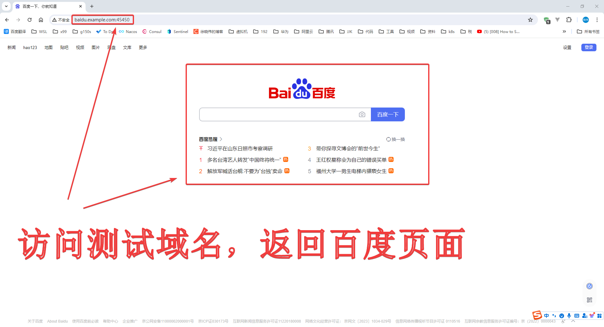
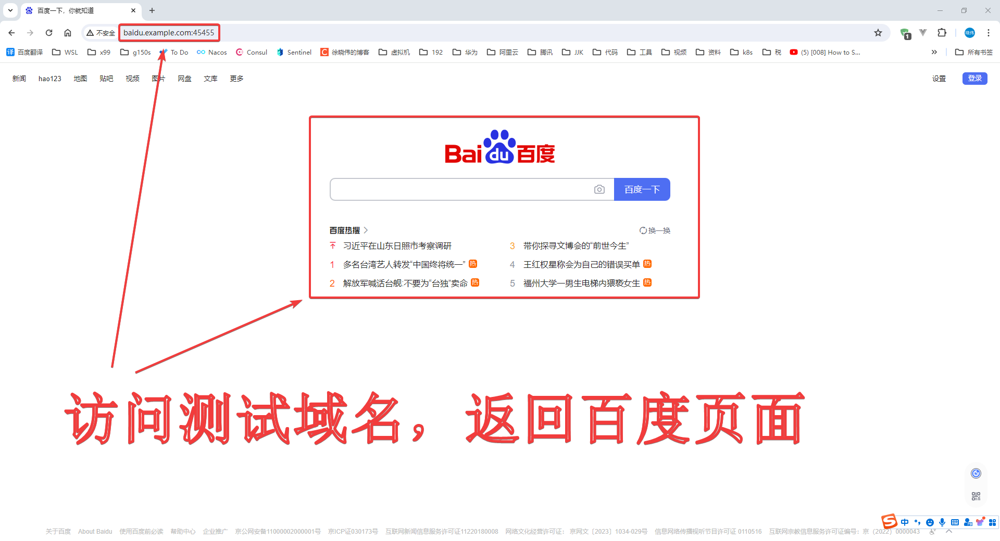

# 快速开始 {id=getting-started}

[[toc]]

## 前提 {id=description}

1. 本项目需要使用域名进行代理，本文使用测试域名 `baidu.example.com` 来代理 `百度` https://www.baidu.com
2. 本文使用的默认端口有 `45450`、`45455`，按照本文正确配置后，可以使用
   http://baidu.example.com:45450、http://baidu.example.com:45455 来访问 `百度`：[体验代理效果](#result)
3. 需要注意：
    1. 开放防火墙的 `45450`、`45455` 端口，
        1. 若自定义了端口，需要使用自己定义的端口进行测试
    2. 由于使用域名代理，访问 域名 `baidu.example.com` 测试的机器，需要在 本机 `hosts` 文件中添加该域名解析到运行本项目服务器的
       IP
        1. Windows hosts 文件位置 `C:\Windows\System32\drivers\etc\hosts`
        2. Linux hosts 文件位置 `/etc/hosts`

## 使用 docker compose 部署 {id=docker-compose}

### docker-compose.yml {id=docker-compose.yml}

1. 在服务器中新建 `docker-compose.yml` 文件
2. `docker-compose.yml` 文件内容如下：可选择 `国内镜像版` 或 `docker hub 版`
3. 根据自己情况做修改
    1. 体验过程可不用修改
4. 下表为 `docker-compose.yml` 文件中的环境变量
    1. 如果要设置 `https`，可配置环境变量
       ```shell
       # --server.ssl.certificate：指定证书的文件路径
       # --server.ssl.certificate-private-key=：指定证书秘钥的文件路径
       export GATEWAY_SHIELD_APP_ARGS="--server.ssl.certificate=/config/xuxiaowei.com.cn.crt --server.ssl.certificate-private-key=/config/xuxiaowei.com.cn.key"
       ```
    2. 如果要启用 `http2`，可配置环境变量
       ```shell
       # --server.http2.enabled=true：用于启用 http2，启用 http2 必须配置 https
       # --server.ssl.certificate：指定证书的文件路径
       # --server.ssl.certificate-private-key=：指定证书秘钥的文件路径
       export GATEWAY_SHIELD_APP_ARGS="--server.http2.enabled=true --server.ssl.certificate=/config/xuxiaowei.com.cn.crt --server.ssl.certificate-private-key=/config/xuxiaowei.com.cn.key"
       ```
    3. 获取访问者的 `运营商信息` 和 `城市信息`，
       请访问 [免费下载 GeoIP 数据库（需要登陆）](https://www.maxmind.com/en/accounts/current/geoip/downloads)
       下载数据库文件并配置环境变量
        1. `GeoLite2 ASN` `Download GZIP` 包含运营商信息
            ```shell
            # 下载 GeoLite2 ASN 的 GZIP 文件并解压，可得到 运营商 数据库文件：GeoLite2-ASN.mmdb
            export GATEWAY_SHIELD_ENABLE_ASN=true GATEWAY_SHIELD_ASN_DATABASE=/config/GeoLite2-ASN_20240510/GeoLite2-ASN.mmdb
            ```
        2. `GeoLite2 City` `Download GZIP` 包含城市信息
            ```shell
            # 下载 GeoLite2 City 的 GZIP 文件并解压，可得到 城市 数据库文件：GeoLite2-City.mmdb
            export GATEWAY_SHIELD_ENABLE_CITY=true GATEWAY_SHIELD_CITY_DATABASE=/config/GeoLite2-City_20240510/GeoLite2-City.mmdb
            ```

| 环境变量                             | 默认值                  | 说明                         |
|----------------------------------|----------------------|----------------------------|
| GATEWAY_HOME                     |                      | 数据挂载根目录                    |
| GATEWAY_SHIELD_PORT              | 45450                | 端口，可用于配置 https             |
| GATEWAY_SHIELD_PORT_HTTP         | 45455                | 端口，仅用于 http 协议             |
| GATEWAY_SHIELD_REDIS_HOST        | gateway-shield-redis | 连接 Redis 的地址               |
| GATEWAY_SHIELD_REDIS_PORT        | 6379                 | 连接 Redis 的端口               |
| GATEWAY_SHIELD_REDIS_DATABASE    | 8                    | 连接 Redis 的数据库              |
| GATEWAY_SHIELD_REDIS_PASSWORD    |                      | 连接 Redis 的密码               |
| GATEWAY_SHIELD_DATABASE_HOST     | gateway-shield-mysql | 连接 MySQL 的地址               |
| GATEWAY_SHIELD_DATABASE_PORT     | 3306                 | 连接 MySQL 的端口               |
| GATEWAY_SHIELD_DATABASE          | gateway_shield       | 连接 MySQL 的数据库              |
| GATEWAY_SHIELD_DATABASE_USERNAME | root                 | 连接 MySQL 的用户名              |
| GATEWAY_SHIELD_DATABASE_PASSWORD | xuxiaowei.com.cn     | 连接 MySQL 密码                |
| GATEWAY_SHIELD_REDIS_ROUTE       | false                | 是否 启用 Redis 路由             |
| GATEWAY_SHIELD_ROUTES_PATH       |                      | Redis 路由 地址                |
| GATEWAY_SHIELD_ENABLE_ASN        | false                | 是否 启用 ASN，可用于获取访问者网络运营商的信息 |
| GATEWAY_SHIELD_ASN_DATABASE      |                      | ASN 的数据库（文件地址）             |
| GATEWAY_SHIELD_ENABLE_CITY       | false                | 是否 启用 获取访问者所在的城市信息         |
| GATEWAY_SHIELD_CITY_DATABASE     |                      | 城市信息 的数据库（文件地址）            |
| GATEWAY_SHIELD_APP_ARGS          |                      | 启动参数                       |

::: code-group

```yaml [使用 国内 镜像]
services:
  gateway-shield:
    image: registry.jihulab.com/xuxiaowei-jihu/xuxiaowei-com-cn/gateway-shield:0.0.1-SNAPSHOT
    restart: always
    container_name: gateway-shield
    networks:
      gateway-shield:
    ports:
      - ${GATEWAY_SHIELD_PORT:-45450}:${GATEWAY_SHIELD_PORT:-45450}
      - ${GATEWAY_SHIELD_PORT_HTTP:-45455}:${GATEWAY_SHIELD_PORT_HTTP:-45455}
    volumes:
      - ${GATEWAY_HOME:-}/gateway-shield/logs:/logs
      - ${GATEWAY_HOME:-}/gateway-shield/config:/config
    environment:
      - GATEWAY_SHIELD_PORT=${GATEWAY_SHIELD_PORT:-45450}
      - GATEWAY_SHIELD_PORT_HTTP=${GATEWAY_SHIELD_PORT_HTTP:-45455}
      - GATEWAY_SHIELD_REDIS_HOST=${GATEWAY_SHIELD_REDIS_HOST:-gateway-shield-redis}
      - GATEWAY_SHIELD_REDIS_PORT=${GATEWAY_SHIELD_REDIS_PORT:-6379}
      - GATEWAY_SHIELD_REDIS_DATABASE=${GATEWAY_SHIELD_REDIS_DATABASE:-8}
      - GATEWAY_SHIELD_REDIS_PASSWORD=${GATEWAY_SHIELD_REDIS_PASSWORD:-}
      - GATEWAY_SHIELD_DATABASE_HOST=${GATEWAY_SHIELD_DATABASE_HOST:-gateway-shield-mysql}
      - GATEWAY_SHIELD_DATABASE_PORT=${GATEWAY_SHIELD_DATABASE_PORT:-3306}
      - GATEWAY_SHIELD_DATABASE=${GATEWAY_SHIELD_DATABASE:-gateway_shield}
      - GATEWAY_SHIELD_DATABASE_USERNAME=${GATEWAY_SHIELD_DATABASE_USERNAME:-root}
      - GATEWAY_SHIELD_DATABASE_PASSWORD=${GATEWAY_SHIELD_DATABASE_PASSWORD:-xuxiaowei.com.cn}
      - GATEWAY_SHIELD_REDIS_ROUTE=${GATEWAY_SHIELD_REDIS_ROUTE:-false}
      - GATEWAY_SHIELD_ROUTES_PATH=${GATEWAY_SHIELD_ROUTES_PATH:-}
      - GATEWAY_SHIELD_ENABLE_ASN=${GATEWAY_SHIELD_ENABLE_ASN:-false}
      - GATEWAY_SHIELD_ASN_DATABASE=${GATEWAY_SHIELD_ASN_DATABASE:-}
      - GATEWAY_SHIELD_ENABLE_CITY=${GATEWAY_SHIELD_ENABLE_CITY:-false}
      - GATEWAY_SHIELD_CITY_DATABASE=${GATEWAY_SHIELD_CITY_DATABASE:-}
      - APP_ARGS=${GATEWAY_SHIELD_APP_ARGS:-}
    depends_on:
      gateway-shield-mysql:
        condition: service_healthy
      gateway-shield-redis:
        condition: service_healthy
  gateway-shield-mysql:
    image: registry.jihulab.com/xuxiaowei-jihu/xuxiaowei-cloud/spring-cloud-xuxiaowei/mysql:8.3.0
    restart: always
    container_name: gateway-shield-mysql
    networks:
      gateway-shield:
    command:
      - --log-bin=mysql-bin
      - --binlog_expire_logs_seconds=1209600
      - --character-set-server=utf8mb4
      - --collation-server=utf8mb4_general_ci
    volumes:
      - ${GATEWAY_HOME:-}/gateway-shield-mysql/data:/var/lib/mysql
      - ${GATEWAY_HOME:-}/gateway-shield-mysql/init:/docker-entrypoint-initdb.d
    healthcheck:
      test: [ "CMD", "mysqladmin", "ping", "-h", "127.0.0.1", "--silent" ]
      interval: 5s
      retries: 5
      start_period: 30s
    environment:
      - MYSQL_ROOT_PASSWORD=${GATEWAY_SHIELD_DATABASE_PASSWORD:-xuxiaowei.com.cn}
      - MYSQL_DATABASE=${GATEWAY_SHIELD_DATABASE:-gateway_shield}
  gateway-shield-redis:
    image: registry.jihulab.com/xuxiaowei-jihu/xuxiaowei-cloud/spring-cloud-xuxiaowei/redis:7.2.4
    restart: always
    container_name: gateway-shield-redis
    networks:
      gateway-shield:
    healthcheck:
      test: [ "CMD", "redis-cli", "ping" ]
      interval: 5s
      retries: 5
      start_period: 10s

networks:
  gateway-shield:
```

```yaml [使用 docker hub 镜像]
services:
  gateway-shield:
    image: xuxiaoweicomcn/gateway-shield:0.0.1-SNAPSHOT
    restart: always
    container_name: gateway-shield
    networks:
      gateway-shield:
    ports:
      - ${GATEWAY_SHIELD_PORT:-45450}:${GATEWAY_SHIELD_PORT:-45450}
      - ${GATEWAY_SHIELD_PORT_HTTP:-45455}:${GATEWAY_SHIELD_PORT_HTTP:-45455}
    volumes:
      - ${GATEWAY_HOME:-}/gateway-shield/logs:/logs
      - ${GATEWAY_HOME:-}/gateway-shield/config:/config
    environment:
      - GATEWAY_SHIELD_PORT=${GATEWAY_SHIELD_PORT:-45450}
      - GATEWAY_SHIELD_PORT_HTTP=${GATEWAY_SHIELD_PORT_HTTP:-45455}
      - GATEWAY_SHIELD_REDIS_HOST=${GATEWAY_SHIELD_REDIS_HOST:-gateway-shield-redis}
      - GATEWAY_SHIELD_REDIS_PORT=${GATEWAY_SHIELD_REDIS_PORT:-6379}
      - GATEWAY_SHIELD_REDIS_DATABASE=${GATEWAY_SHIELD_REDIS_DATABASE:-8}
      - GATEWAY_SHIELD_REDIS_PASSWORD=${GATEWAY_SHIELD_REDIS_PASSWORD:-}
      - GATEWAY_SHIELD_DATABASE_HOST=${GATEWAY_SHIELD_DATABASE_HOST:-gateway-shield-mysql}
      - GATEWAY_SHIELD_DATABASE_PORT=${GATEWAY_SHIELD_DATABASE_PORT:-3306}
      - GATEWAY_SHIELD_DATABASE=${GATEWAY_SHIELD_DATABASE:-gateway_shield}
      - GATEWAY_SHIELD_DATABASE_USERNAME=${GATEWAY_SHIELD_DATABASE_USERNAME:-root}
      - GATEWAY_SHIELD_DATABASE_PASSWORD=${GATEWAY_SHIELD_DATABASE_PASSWORD:-xuxiaowei.com.cn}
      - GATEWAY_SHIELD_REDIS_ROUTE=${GATEWAY_SHIELD_REDIS_ROUTE:-false}
      - GATEWAY_SHIELD_ROUTES_PATH=${GATEWAY_SHIELD_ROUTES_PATH:-}
      - GATEWAY_SHIELD_ENABLE_ASN=${GATEWAY_SHIELD_ENABLE_ASN:-false}
      - GATEWAY_SHIELD_ASN_DATABASE=${GATEWAY_SHIELD_ASN_DATABASE:-}
      - GATEWAY_SHIELD_ENABLE_CITY=${GATEWAY_SHIELD_ENABLE_CITY:-false}
      - GATEWAY_SHIELD_CITY_DATABASE=${GATEWAY_SHIELD_CITY_DATABASE:-}
      - APP_ARGS=${GATEWAY_SHIELD_APP_ARGS:-}
    depends_on:
      gateway-shield-mysql:
        condition: service_healthy
      gateway-shield-redis:
        condition: service_healthy
  gateway-shield-mysql:
    image: mysql:8.3.0
    restart: always
    container_name: gateway-shield-mysql
    networks:
      gateway-shield:
    command:
      - --log-bin=mysql-bin
      - --binlog_expire_logs_seconds=1209600
      - --character-set-server=utf8mb4
      - --collation-server=utf8mb4_general_ci
    volumes:
      - ${GATEWAY_HOME:-}/gateway-shield-mysql/data:/var/lib/mysql
      - ${GATEWAY_HOME:-}/gateway-shield-mysql/init:/docker-entrypoint-initdb.d
    healthcheck:
      test: [ "CMD", "mysqladmin", "ping", "-h", "127.0.0.1", "--silent" ]
      interval: 5s
      retries: 5
      start_period: 30s
    environment:
      - MYSQL_ROOT_PASSWORD=${GATEWAY_SHIELD_DATABASE_PASSWORD:-xuxiaowei.com.cn}
      - MYSQL_DATABASE=${GATEWAY_SHIELD_DATABASE:-gateway_shield}
  gateway-shield-redis:
    image: redis:7.2.4
    restart: always
    container_name: gateway-shield-redis
    networks:
      gateway-shield:
    healthcheck:
      test: [ "CMD", "redis-cli", "ping" ]
      interval: 5s
      retries: 5
      start_period: 10s

networks:
  gateway-shield:
```

:::

### MySQL 初始化表结构 {id=mysql-init}

1. 将项目中 [sql](https://gitee.com/xuxiaowei-com-cn/gateway-shield/tree/main/sql)
   文件夹中的 [gateway_shield.sql](https://gitee.com/xuxiaowei-com-cn/gateway-shield/blob/main/sql/gateway_shield.sql)
   文件复制到 `${GATEWAY_HOME:-}/gateway-shield-mysql/init` 文件夹下
    1. 其中 `GATEWAY_HOME` 是环境变量，可以不设置。如果不设置，
       [gateway_shield.sql](https://gitee.com/xuxiaowei-com-cn/gateway-shield/blob/main/sql/gateway_shield.sql)
       文件放在 `/gateway-shield-mysql/init` 文件夹下

### 运行 docker compose {id=run-docker-compose}

```shell
# GATEWAY_SHIELD_REDIS_ROUTE：开启 Redis 路由
# GATEWAY_SHIELD_ROUTES_PATH：配置 Redis 路由刷新的地址，本地址默认仅支持内网访问，内网范围：10.0.0.0/8、172.16.0.0/12、192.168.0.0/16
export GATEWAY_SHIELD_REDIS_ROUTE=true GATEWAY_SHIELD_ROUTES_PATH=/route && docker compose up -d
```

## 增加代理 {id=proxy}

### 在 redis 中增加数据

- 默认使用的 Redis 数据库是 `8`
- 根据自己的情况，设置 redis 中的路由
    - 本文使用直接在服务器上操作添加 Redis 路由数据

1. 进入到 redis 容器内
   ::: code-group
    ```shell [执行命令]
    docker exec -it gateway-shield-redis bash
    ```
    ```shell [操作示例的过程]
    [root@anolis ~]# docker exec -it gateway-shield-redis bash
    root@57654b5bdf57:/data#
    ```
   :::
2. 进入 redis 命令行中
   ::: code-group
    ```shell [执行命令]
    redis-cli
    ```
    ```shell [操作示例的过程]
    [root@anolis ~]# docker exec -it gateway-shield-redis bash
    root@57654b5bdf57:/data# redis-cli
    127.0.0.1:6379>
    ```
   :::
3. 选择 8 号数据库
   ::: code-group
    ```shell [执行命令]
    select 8
    ```
    ```shell [操作示例的过程]
    [root@anolis ~]# docker exec -it gateway-shield-redis bash
    root@57654b5bdf57:/data# redis-cli
    127.0.0.1:6379> select 8
    OK
    127.0.0.1:6379[8]>
    ```
   :::
4. 添加数据
   ::: code-group
    ```shell [在 Redis 中添加 路由数据]
    # Redis key 必须使用 routedefinition_ 开头
    # Redis key 使用 : 可以在 Redis 管理工具中进行折叠，方便操作
    set routedefinition_:www.baidu.com "{\"id\":\"www-baidu-com\",\"predicates\":[{\"name\":\"Host\",\"args\":{\"args1\":\"baidu.example.com:*\"}}],\"filters\":[],\"uri\":\"https://www.baidu.com\",\"metadata\":{},\"order\": 0}"
    ```
    ```json5 [路由数据 解释]
    {
      // id：唯一就行
      "id": "www-baidu-com",
      // 配置代理时的匹配规则，可配置多个值
      "predicates": [
        {
          // Host：根据域名匹配
          "name": "Host",
          "args": {
            // args1：代表 key，不能重复
            // baidu.example.com:*：匹配的域名，其中 * 代表所有端口
            // 如果配置的是 baidu.example.com，支持 http://baidu.example.com、https://baidu.example.com，但不支持 https://baidu.example.com:443
            // 此处可配置多个值，只要 key 不同即可
            "args1": "baidu.example.com:*"
          }
        }
      ],
      "filters": [],
      // 代理的目标地址
      "uri": "https://www.baidu.com",
      "metadata": {
    
      },
      "order": 0
    }
    ```
    ```shell [操作示例的过程]
    [root@anolis ~]# docker exec -it gateway-shield-redis bash
    root@57654b5bdf57:/data# redis-cli
    127.0.0.1:6379> select 8
    OK
    127.0.0.1:6379[8]> set routedefinition_:www.baidu.com "{\"id\":\"www-baidu-com\",\"predicates\":[{\"name\":\"Host\",\"args\":{\"args1\":\"baidu.example.com:*\"}}],\"filters\":[],\"uri\":\"https://www.baidu.com\",\"metadata\":{},\"order\": 0}"
    OK
    127.0.0.1:6379[8]> get routedefinition_:www.baidu.com
    "{\"id\":\"www-baidu-com\",\"predicates\":[{\"name\":\"Host\",\"args\":{\"args1\":\"baidu.example.com:*\"}}],\"filters\":[],\"uri\":\"https://www.baidu.com\",\"metadata\":{},\"order\": 0}"
    127.0.0.1:6379[8]>
    ```
   :::

### 刷新路由

- Redis 路由数据发生变更时，需要在 服务器 手动访问 http://127.0.0.1:45450/route
- 本地址默认仅支持内网访问，内网范围：10.0.0.0/8、172.16.0.0/12、192.168.0.0/16

```shell
[root@anolis ~]# curl http://127.0.0.1:45450/route && echo
{"msg":"刷新路由成功"}
[root@anolis ~]# 
```

## 体验代理效果 {id=result}

- 测试机器解析 域名 `baidu.example.com` 到 服务器
- 服务器开放 `45450`、`45455`
- 访问 http://baidu.example.com:45450 效果
  
- 访问 http://baidu.example.com:45455 效果
  

## 使用 Redis Key 前缀匹配，是否影响效率？{id=efficiency}

1. 正常开发时，不建议直接使用 Redis Key 前缀查询所有符合条件的匹配结果，效率可能不高
2. 但是网关路由可以基于 Redis Key 前缀查询所有符合条件的匹配结果：加载时间不会影响网关路由的性能（非实时性）
    1. 手动触发，不需要实时触发
    2. 网关 Redis 路由仅在修改后，手动触发加载一次即可
3. 总结
    1. 没有最好的方案，只有最合适的方案
        1. 不要认为某种方案存在一些缺陷就不能选择了，要根据实际情况分析，选择最合适的方案，权衡利弊
